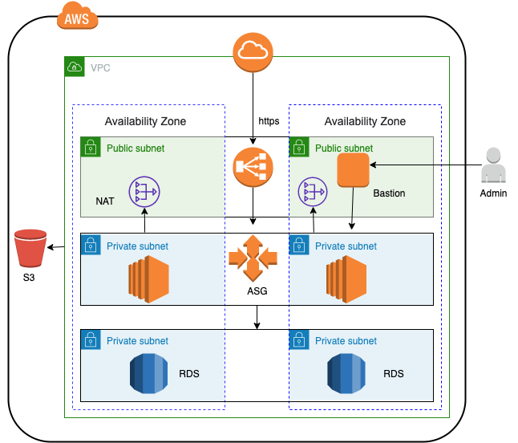
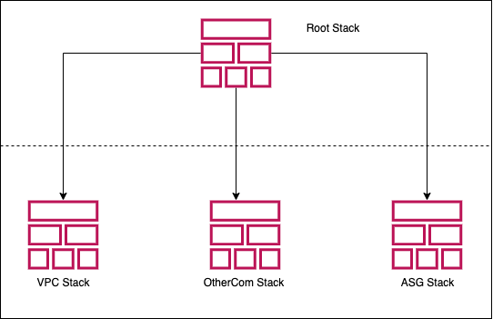

# Secure Three-Tier Architecture in AWS (CloudFormation)

A three-tier architecture is a software architecture pattern where the application is broken down into three logical tiers: the presentation layer, the business logic layer and the data storage layer. Each of these layers or tiers does a specific task and can be managed independently of each other. This a shift from the monolithic way of building an application where the Loadbalancer in public subnet, the backend and the database are both sitting in private subnet. All private subnet resources can be manageable via bastion host for operation purpose.



This three-tier cloud infrastructure build on Amazon Web Service (AWS) with services: Elastic Compute Cloud (EC2), Auto Scaling Group, Virtual Private Cloud(VPC), Elastic Load Balancer (ELB), RDS, Security Groups and the Internet Gateway. This infrastructure is designed to be highly available and fault tolerant.

Various cloudformation stacks used here to provision infrastructure automatically. High level overview of the stack is given below.



## Prerequisite

1. You must have AWSCli installed and configured in your system. See [here](https://docs.aws.amazon.com/cli/latest/userguide/getting-started-install.html)
2. You should have the permission to create resources like
   * IAM Policy
   * IAM Role
   * S3 Bucket
   * AutoScalling Group
   * LoadBalancer
   * RDS
   * SecurityGroup
   * CloudFormation
   * VPC
   * Route53
   * Certificate Manager

## How to provision this infrastructure

To provision this infrastructure follow the steps given below.

1. Run the deploy.sh file.

``` bash
$ ./deploy.sh
```
2. Now you have to provide few inputs

```bash
$ ./deploy.sh
Enter your S3 bucket name to upload packages : codefrnd
Enter your region where you want to spinup infrastructure : us-west-2
Enter your environment name : codefrnd
Enter your domain name : tmbmarble.com
Enter your route53 domain hosted zone ID : XXXXXXXXX
Enter your DB user name : admin
Enter your DB password : (Hidden text)
Enter your IP from which you wish to connect bastion host : (Your IP from where you want to SSH to bastion host)
Enter your ssh key : ssh-rsa AAAAB3NzaC1yc2EAAAADAQABAAABgQDL5WkRAolo5CPJz7OMvQXXXXXXXXXXXXXXXX
```
## Output

```bash
{
    "Location": "http://codefrnd.s3.amazonaws.com/"
}
Successfully packaged artifacts and wrote output template to file packaged.yaml.
Execute the following command to deploy the packaged template
aws cloudformation deploy --template-file /path/to/3-tier-cfn/packaged.yaml --stack-name <YOUR STACK NAME>
Deployment will be start shortly.

Waiting for changeset to be created..
Waiting for stack create/update to complete

```

## TODO

* Some parmeters are in default. Need to modify the stack as user inputs
